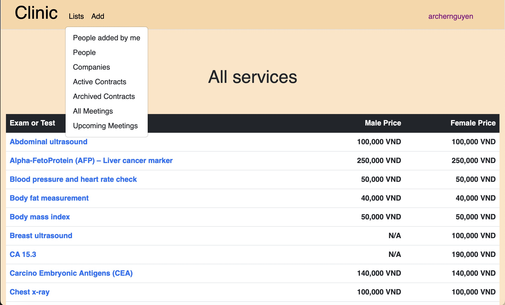

# HOSPITAL

# Distinctiveness and Complexity
## A. Distinctiveness
This web application, developed using the Django framework, is designed to assist various hierarchical levels within a hospital's sales department, including staff members and managers. Its primary objective is to facilitate efficient management and organization of client information, encompassing details such as company names, representatives, workforce statistics, historical contracts, meeting agreements, and client communications. The overarching goals of this application are to mitigate the burden of time-consuming paperwork, enhance data management efficiency, ensure meticulous preparation for upcoming client meetings, and elevate the overall experience for clients interacting with the hospital's sales department.
<br>
Unlike Pizza project, which designed for online orders, focusing on functionalities like menu navigation, cart management, and order placement, or Network project facilitating user interaction through posts, likes, and follows, the Hospital application distinguishes itself by offering a comprehensive suite of features tailored for the intricate data structures prevalent in the healthcare sector. These encompass the management of vital information including company details, representatives, headcounts, contract records, meeting logistics, and client communications.
<br>
Furthermore, the Hospital application exhibits a level of intricacy in user roles and permissions beyond that of other applications in the course. This complexity arises from the implementation of a hierarchical structure, providing distint levels of access tailored to different users. This stratified approach ensures that individuals within the hospital's sales department and managerial staff possess nuanced permissions aligned with their responsibilities. Such granularity in access control enhances the security and confidentiality of sensitive information, setting the Hospital application apart in its commitment to data integrity and user-specific functionality.
<br><br>
Here are distinctive features of the application that set it apart from other projects in the course:

### 1. Efficient Meeting Schedule Management
In the clinical setting where I had the opportunity to work, meetings were traditionally prepared using physical notes, Word documents, or Microsoft Excel files. Over time, these files and notes accumulated, becoming scattered across various locations on their computers, leading to significant time costs whenever retrieval was necessary, especially after months or years. My application streamlines this process by enabling users to efficiently prepare information before meetings and store the results, facilitating quick and easy reference at a later time.
<br><br>
In detail, it allows users to schedule future meetings with clients, encompassing details such as clients' names and meeting agendas. The system also checks for potential overlaps with other scheduled meetings, ensuring efficient management of the meeting calendar.
<br><br>
After each meeting, users have the capability to store the results and agenda details, providing them with convenient access to this information at any time.

### 2. Upcoming Contracts Alert
The contract list is presented in chronological order. When a contract's initiation date is within 10 days from the current date, it turns red to alert users. This feature ensures that users are promtly notified of impending tasks, allowing them to address any necessary actions before they become overdue.

### 3. Streamlined Contract Composition
Traditionally, crafting a new contract involves extracting details from an existing document in a word file, requiring users to manually tweak information to meet updated requirements. In contrast, my application significantly accelerates this process by automatically populating the contract with data from the database directly into the document editor. The majority of essential information is readily available in the contract, allowing users to make necessary adjustments while adhering to agreements set by the representatives. This not only expedites the process but also eliminates the need for time-consuming manual data entry.

### 4. Secure Storage of Contract Documents in PDF Format
Traditionally, after contracts were signed, salespersons would scan and store them on their computers. However, these documents often ended up forgotten and were challenging to locate in the future. With my Hospital application, users can securely store contracts directly in the contract database, ensuring easy retrieval and eliminating the risk of misplacement.

### 5. User Account Differentiation for Varied Management Permissions
In the current system, users are categorized into four levels: 0, 1, 2, and 3. Level 0 users, typically clients or staff, are granted access solely to services, test, examination information, and pricing details. As the user level increases, individuals gain access to more critical information and greater execution capabilities. Notably, top-level users possess the authority to modify the levels of other users. This tiered structure plays a pivotal role in safeguarding against information leakage, unauthorized actions, or intentional manipulation of crucial data.

### 6. Seamless Mobile Experience
Ensuring optimal mobile responsiveness is imperative for a user-friendly experience. Without this feature, navigating the web application on mobile devices becomes cumbersome. Elements like the navigation bar appear too small, forms become overly narrow, resulting in a distorted appearance, and text may shift uncomfortably, making it difficult to read. My user interface is meticulously crafted to dynamically respond to varying browser widths, enhancing the mobile user's ability to effortlessly check information, input data, and accomplish tasks with unparalleled ease.

## B. Complexity
Designing and implementing this web application from scratch using the Django framework, Python, and JavaScript was a significant undertaking. Despite the potential for additional features and modifications, I dedicated considerable time and resources to complete the design, code writing, bug fixing, and testing. The project comprises 35 routes, approximately 2000 lines of code in views, 24 HTML files in the templates folder, and 20 JavaScript files in the static folder. Notably, the effects and animations of the forms, mobile navigation bar, and buttons were developed without relying on external tools or libraries, especially those related to user permissions in HTML files. Key aspects of the project required careful consideration and problem-solving to ensure its successful implementation.

### 1. Hospital Project Model
In initiating the development of this application, my objective was to simplify and expedite the retrieval of historical contract and meeting information. Consequently, I designed and implemented the following models: Company, Contract, MeetUp, and Service, with the aim of efficiently storing and managing this data in the database.

#### a. Company
In the Company model, it was necessary to store crucial information such as name, industry, address, email, phone, representative, headcount, the user who created the entry, and the user who recently modified the instance. Subsequently, I recognized the need for two additional models to manage representative and user details. To address this, I created the People and User classes.

#### b. People
The People model encompasses fields for storing a person's name, associated company (linked to the Company model), company position, address, email, phone, notes, the user who created the entry (created_by), and the user who recently modified the instance (modified_by).

#### c. User


The User related to many other models, and besides the other standard fields which were created for AbstractUser, I created a field that allow User to be classified into 3 levels: the LOW (level 1), the MIDDLE (level 2), and the TOP (level 3), management_right_level" will decided by a top level admin so that only certain users can access or modified important information. Manage users permissions maybe one of the most challenging tasks when creating this app because checking the permission has to be done almost all the route in both back end and front end.

#### d. ContactDiary
I want user can save message from people, thus I created a new model that named ContactDiary, which store message's content, the sent date, and the person that sent that message.

#### e. MeetUp
In MeetUp model, which used to store meetings' information, I save start time, end time, the company client, the time created, and a field that allow user to know that if the meeting was ended or not. This field is also important to decide to show or not show some important information of meeting in the front end, such as hide the edit button and end meeting button and show the meeting's results when the meeting was ended. 

#### f. MeetingAgendaItem
For storing meeting's agenda information, I created MeetingAgendaItem model in order to save result for each item of the meeting
<br>
MeetingAgendaItem model only save the item name, the result, and the meeting that related to it.

#### g. Contract
The Contract model was used to save important information such as: client (which related to Company model), service (which related to Service), male_headcount, female_headcount, total contract value, discount, revenue after subtract discount value, initiation date of the contract, created date, the user that created contract, the user that modified the contract, the field that use to store pdf file of the contract, the archived date and the user that archived the contracts. Storing and retrieving pdf file in Django project that need further step than other field, which make the task even more complex. I also need to create the Service model to represent the test or examination that the client choose to perform by the hospital or clinic.

#### h. Service
Service model store information of the test or examination, including name, benefit, description, the price for male and female, the user that created and modified the instance.

### 2. Create accounts and log in, log out
The web application allow user to create their own account, with the management level of 0. Besides the normal check when user create new account like username duplicate with the existing one, or password not correct, I create a function that check if user's password has at least a special character, a number, an alphabet, and 6 characters in length. If username already existed in the database, user would also receive alert and have to user other username. Whenever user fail an attemp, the browser to render an alert that inform them the cause of the error.

### 3. Check permission
For every created account, their default management level is 0, until checked and modified by top level management user. In the early days, I wrote routes that just check user level and decide if that level can or can not do in that certain routes. However, I realize that every time I need to add more permission for certain level, I need to check and rewrite every route, and have to modify every single html and js file relate to that route. Therefore, I decided to create a function that define all the permissions, or rights in a list, and define the user level that are allowed to have that permission, which can then be modified if needed with minimum effort. Then in every route, the function will check that if the current user has permission to do that specific task or not. That's make the code much more maintainable.
<br><br>
The checking permission can be better understand in this example, in company_detail route, which allow user to access company's information and modify it. If user clicking link or being redirected to the route. That user would need the permission: "read_company_info". The code will retrieve user level, then compare with the list of permissions in helpers.py via user_right function, then decide if the user is legit or not for accessing. If user submit the form to modify the company detail, the code will check the permission: "modify_company_info" the same way to know that if the user has that permission or not. Moreover, I also have a route that receive HTTP request from user interface to check user permission named "check_right". The user interface would first check if the user was logged in or not, if not, the navigation bar would hide all the tags and button that required log in, if yes, then it will send HTTP request to the server to check user permission, with the answer from the server, it will decide which part of the web was displayed and which part was hidden.

### 4. Personal list of contact
For management reason, lower level salesman can only access contact information of their own, and if they need to modify their own contacts, they need help from higher level user, who can decide if the modification is necessary or not. Higher level user can access all contacts information.

### 5. Personal navigation bar
For user management and business security purpose, user can only access actions, information pages appropriate with their management level, the other parts were hidden, the server side also check every route and action if the user level is ligitimate or not in case someone trying to access the action in user interface or somehow sent request to the server. If user was found trying to access an url that is not supposed to be allow to them, they were redirected back to index or the route that they are allowed.

### 6. Store pdf files of scanned contracts
For storing and retrieving pdf files, I have to add a few line to settings.py in order to set the root and url for the system to store the file, which named "MEDIA_ROOT" and "MEDIA_URL".
<br><br>
In urls.py in the app directory, I have to import setting from django.conf, and static from django.conf.urls.static, and add these line in the end of urls.py for serving media files:
<br><br>
if setting.DEBUG:<br>
&emsp; urlpatterns += static(setting.MEDIA_URL, document_root=setting.MEDIA_ROOT)
<br><br>
in html file, the file has to be display in an anchor like:
<br><br>
```<a href="{{ contract.pdf_file.url }}" target="_blank">View file</a>``` 
<br><br>

### 7. Generate docx
In order to help reducing the composing time of a contract, a route was create to help gather contract's information, calculate the total cost, discount, and price after discount, and display them in the contract that salesman only need to modify minimum necessary terms according to the requirement of parties in the contract.
<br><br>
When user click the generate docx button on a contract, the code will first check the permission of the user, then access the contract information, then composing the contract including the current date, the contract standard agreement (which can be modified in composing window), the information of the clinic which contains mobile phone, representatives, email, address, the client's information, the services, test, and examination they chose, the initial date that they want to execute the contract, the headcount that will be using the services, total price, discount, total payment, date of payment, and all other information was composed ready for user to check and modify if needed. Finally, user can print the file and use it for signing, then scan it and send to the client as well as store it for reference later.

### 8. User Interface Design
When the width was below 767px, the navigation bar was changed to a hamburger menu button, the items were displayed vertically instead of horizontally. The forms also become larger when using mobile.
<br><br>
This is the page when the width is larger than 767px:


<br><br>
This is the page when the width is smaller than 767px:


